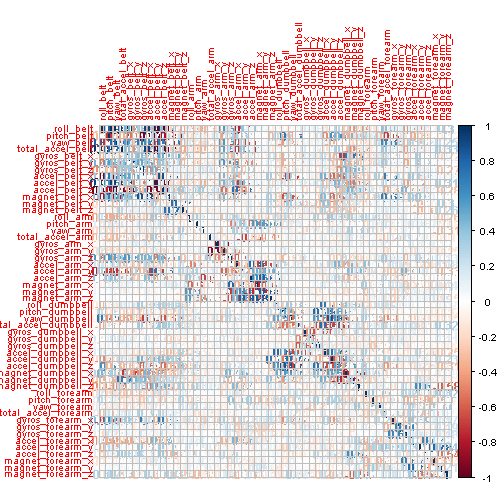

# PRACTICAL MACHINE LEARNING FINAL PROJECT

AUTHOR : Nicolas A. Leali

Date: 20th July of 2014

# Project over View: 
The goal of this project is to predict the manner in which they did the exercise. This is the "classe" variable in the training set. You may use any of the other variables to predict with. You should create a report describing how you built your model, how you used cross validation, what you think the expected out of sample error is, and why you made the choices you did. You will also use your prediction model to predict 20 different test cases. 


Data:

The training data for this project are available here: 

https://d396qusza40orc.cloudfront.net/predmachlearn/pml-training.csv

The test data are available here: 

https://d396qusza40orc.cloudfront.net/predmachlearn/pml-testing.csv

All this data came from  http://groupware.les.inf.puc-rio.br/har.


```r
#loading librarys

library(caret)
```

```
## Loading required package: lattice
## Loading required package: ggplot2
```

```r
library(ggplot2)
library(knitr)
library(corrplot)
library(randomForest)
```

```
## randomForest 4.6-10
## Type rfNews() to see new features/changes/bug fixes.
```


```r
#Load the data into training and test variables
training <- read.csv("pml-training.csv")

test <- read.csv("pml-testing.csv")
```


```r
## We take out all those indicators near to Zero Variance from the data set.

nzv <- nearZeroVar(training)

training <- training[-nzv]
test <- test[-nzv]


#Some variables contains NA values. so we remove them to improve the accuracy of the model.

#Training
NAs <- apply(training, 2, function(x) {
    sum(is.na(x))
})

training2 <-training[, which(NAs == 0)]

#Test
NAs <- apply(test, 2, function(x) {
    sum(is.na(x))
})

test2 <-test[, which(NAs == 0)]
```

We explore the data we have


```r
dim(training2)
```

```
## [1] 19622    59
```

```r
head(training2)
```

```
##   X user_name raw_timestamp_part_1 raw_timestamp_part_2   cvtd_timestamp
## 1 1  carlitos           1323084231               788290 05/12/2011 11:23
## 2 2  carlitos           1323084231               808298 05/12/2011 11:23
## 3 3  carlitos           1323084231               820366 05/12/2011 11:23
## 4 4  carlitos           1323084232               120339 05/12/2011 11:23
## 5 5  carlitos           1323084232               196328 05/12/2011 11:23
## 6 6  carlitos           1323084232               304277 05/12/2011 11:23
##   num_window roll_belt pitch_belt yaw_belt total_accel_belt gyros_belt_x
## 1         11      1.41       8.07    -94.4                3         0.00
## 2         11      1.41       8.07    -94.4                3         0.02
## 3         11      1.42       8.07    -94.4                3         0.00
## 4         12      1.48       8.05    -94.4                3         0.02
## 5         12      1.48       8.07    -94.4                3         0.02
## 6         12      1.45       8.06    -94.4                3         0.02
##   gyros_belt_y gyros_belt_z accel_belt_x accel_belt_y accel_belt_z
## 1         0.00        -0.02          -21            4           22
## 2         0.00        -0.02          -22            4           22
## 3         0.00        -0.02          -20            5           23
## 4         0.00        -0.03          -22            3           21
## 5         0.02        -0.02          -21            2           24
## 6         0.00        -0.02          -21            4           21
##   magnet_belt_x magnet_belt_y magnet_belt_z roll_arm pitch_arm yaw_arm
## 1            -3           599          -313     -128      22.5    -161
## 2            -7           608          -311     -128      22.5    -161
## 3            -2           600          -305     -128      22.5    -161
## 4            -6           604          -310     -128      22.1    -161
## 5            -6           600          -302     -128      22.1    -161
## 6             0           603          -312     -128      22.0    -161
##   total_accel_arm gyros_arm_x gyros_arm_y gyros_arm_z accel_arm_x
## 1              34        0.00        0.00       -0.02        -288
## 2              34        0.02       -0.02       -0.02        -290
## 3              34        0.02       -0.02       -0.02        -289
## 4              34        0.02       -0.03        0.02        -289
## 5              34        0.00       -0.03        0.00        -289
## 6              34        0.02       -0.03        0.00        -289
##   accel_arm_y accel_arm_z magnet_arm_x magnet_arm_y magnet_arm_z
## 1         109        -123         -368          337          516
## 2         110        -125         -369          337          513
## 3         110        -126         -368          344          513
## 4         111        -123         -372          344          512
## 5         111        -123         -374          337          506
## 6         111        -122         -369          342          513
##   roll_dumbbell pitch_dumbbell yaw_dumbbell total_accel_dumbbell
## 1         13.05         -70.49       -84.87                   37
## 2         13.13         -70.64       -84.71                   37
## 3         12.85         -70.28       -85.14                   37
## 4         13.43         -70.39       -84.87                   37
## 5         13.38         -70.43       -84.85                   37
## 6         13.38         -70.82       -84.47                   37
##   gyros_dumbbell_x gyros_dumbbell_y gyros_dumbbell_z accel_dumbbell_x
## 1                0            -0.02             0.00             -234
## 2                0            -0.02             0.00             -233
## 3                0            -0.02             0.00             -232
## 4                0            -0.02            -0.02             -232
## 5                0            -0.02             0.00             -233
## 6                0            -0.02             0.00             -234
##   accel_dumbbell_y accel_dumbbell_z magnet_dumbbell_x magnet_dumbbell_y
## 1               47             -271              -559               293
## 2               47             -269              -555               296
## 3               46             -270              -561               298
## 4               48             -269              -552               303
## 5               48             -270              -554               292
## 6               48             -269              -558               294
##   magnet_dumbbell_z roll_forearm pitch_forearm yaw_forearm
## 1               -65         28.4         -63.9        -153
## 2               -64         28.3         -63.9        -153
## 3               -63         28.3         -63.9        -152
## 4               -60         28.1         -63.9        -152
## 5               -68         28.0         -63.9        -152
## 6               -66         27.9         -63.9        -152
##   total_accel_forearm gyros_forearm_x gyros_forearm_y gyros_forearm_z
## 1                  36            0.03            0.00           -0.02
## 2                  36            0.02            0.00           -0.02
## 3                  36            0.03           -0.02            0.00
## 4                  36            0.02           -0.02            0.00
## 5                  36            0.02            0.00           -0.02
## 6                  36            0.02           -0.02           -0.03
##   accel_forearm_x accel_forearm_y accel_forearm_z magnet_forearm_x
## 1             192             203            -215              -17
## 2             192             203            -216              -18
## 3             196             204            -213              -18
## 4             189             206            -214              -16
## 5             189             206            -214              -17
## 6             193             203            -215               -9
##   magnet_forearm_y magnet_forearm_z classe
## 1              654              476      A
## 2              661              473      A
## 3              658              469      A
## 4              658              469      A
## 5              655              473      A
## 6              660              478      A
```


```r
#take a look at our outcome variable classes

table(training2$classe)
```

```
## 
##    A    B    C    D    E 
## 5580 3797 3422 3216 3607
```


#The original given training set is 19622X93, Because of that We split  the training data set into a smaller training a test dataset to construct the model to predict.


```r
set.seed(1234)
trainingpart = createDataPartition(training2$classe, p = 0.02, list = FALSE)
partTraining = training2[ trainingpart,]
partTest =  training2[-trainingpart,]

#Now we have 14718 Rows X 93 Columns

dim(partTraining)
```

```
## [1] 395  59
```

```r
# finally we study the correlation between  variables.

Metd.Cod = cor( partTraining[,-c(grep("timestamp|X|user_name|num_window|new_window",names(partTraining)), length(partTraining))])
corrplot(Metd.Cod, method="number",tl.cex=0.8)
```

 

## With this exploratory analisys we can start with our Model.


```r
#we construct the model  with the  prediction data    where the column class is the outcome and other features are as predictors.

# This is our model
DataModel <- train(partTraining$classe ~ ., method = "rf", trControl = trainControl(method = "cv", number = 4), 
    partTraining)

summary(DataModel)
```

```
##                 Length Class      Mode     
## call               4   -none-     call     
## type               1   -none-     character
## predicted        395   factor     numeric  
## err.rate        3000   -none-     numeric  
## confusion         30   -none-     numeric  
## votes           1975   matrix     numeric  
## oob.times        395   -none-     numeric  
## classes            5   -none-     character
## importance        80   -none-     numeric  
## importanceSD       0   -none-     NULL     
## localImportance    0   -none-     NULL     
## proximity          0   -none-     NULL     
## ntree              1   -none-     numeric  
## mtry               1   -none-     numeric  
## forest            14   -none-     list     
## y                395   factor     numeric  
## test               0   -none-     NULL     
## inbag              0   -none-     NULL     
## xNames            80   -none-     character
## problemType        1   -none-     character
## tuneValue          1   data.frame list     
## obsLevels          5   -none-     character
```


```r
DataModel$finalModel
```

```
## 
## Call:
##  randomForest(x = x, y = y, mtry = param$mtry) 
##                Type of random forest: classification
##                      Number of trees: 500
## No. of variables tried at each split: 41
## 
##         OOB estimate of  error rate: 0.51%
## Confusion matrix:
##     A  B  C  D  E class.error
## A 111  1  0  0  0    0.008929
## B   1 75  0  0  0    0.013158
## C   0  0 69  0  0    0.000000
## D   0  0  0 65  0    0.000000
## E   0  0  0  0 73    0.000000
```


```r
print(DataModel, digits = 3)
```

```
## Random Forest 
## 
## 395 samples
##  58 predictors
##   5 classes: 'A', 'B', 'C', 'D', 'E' 
## 
## No pre-processing
## Resampling: Cross-Validated (4 fold) 
## 
## Summary of sample sizes: 296, 295, 297, 297 
## 
## Resampling results across tuning parameters:
## 
##   mtry  Accuracy  Kappa  Accuracy SD  Kappa SD
##   2     0.894     0.865  0.0109       0.0141  
##   41    0.997     0.997  0.0051       0.00645 
##   80    0.997     0.997  0.0051       0.00645 
## 
## Accuracy was used to select the optimal model using  the largest value.
## The final value used for the model was mtry = 41.
```


```r
# With this code we get de prediction data

Prediction <- predict(DataModel, partTest)

##  1  2  3  4  5  6  7  8  9 10 11 12 13 14 15 16 17 18 19 20 
##  B  A  B  A  A  E  D  B  A  A  B  C  B  A  E  E  A  B  B  B 
## Levels: A B C D E
```

## Expected out put Error 


```r
Error <- confusionMatrix(Prediction, partTest$classe)
Error
```

```
## Confusion Matrix and Statistics
## 
##           Reference
## Prediction    A    B    C    D    E
##          A 5468    1    0    0    0
##          B    0 3720   38    0    0
##          C    0    0 3315    0    0
##          D    0    0    0 3151    0
##          E    0    0    0    0 3534
## 
## Overall Statistics
##                                         
##                Accuracy : 0.998         
##                  95% CI : (0.997, 0.999)
##     No Information Rate : 0.284         
##     P-Value [Acc > NIR] : <2e-16        
##                                         
##                   Kappa : 0.997         
##  Mcnemar's Test P-Value : NA            
## 
## Statistics by Class:
## 
##                      Class: A Class: B Class: C Class: D Class: E
## Sensitivity             1.000    1.000    0.989    1.000    1.000
## Specificity             1.000    0.998    1.000    1.000    1.000
## Pos Pred Value          1.000    0.990    1.000    1.000    1.000
## Neg Pred Value          1.000    1.000    0.998    1.000    1.000
## Prevalence              0.284    0.194    0.174    0.164    0.184
## Detection Rate          0.284    0.193    0.172    0.164    0.184
## Detection Prevalence    0.284    0.195    0.172    0.164    0.184
## Balanced Accuracy       1.000    0.999    0.994    1.000    1.000
```
#The expect error por this analysis is 0.997%. Which is inside what we where expecting.
# So this indicated that we can give good prediction about this topic with the accelerometers technology.

## The 20 data cases.


```r
answers<- as.vector(Prediction[1:20])
Last_Point = function(x){
  n = length(x)
  for(i in 1:n){
    filename = paste0("problem_id_",i,".txt")
    write.table(x[i],file=filename,quote=FALSE,row.names=FALSE,col.names=FALSE)
  }
}
Last_Point(answers)
```


